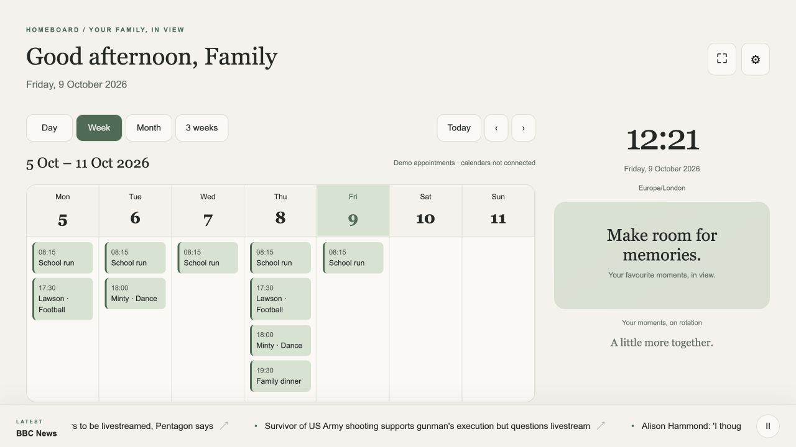
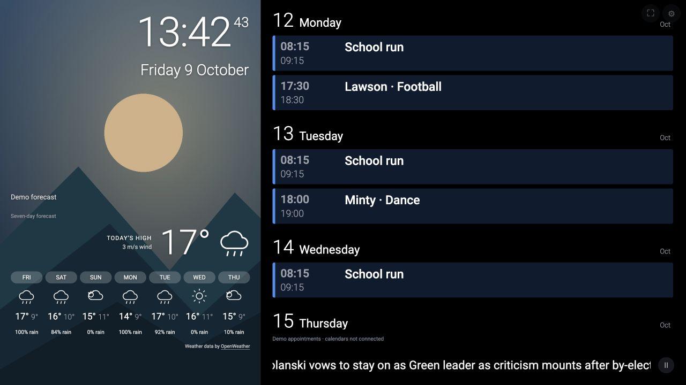
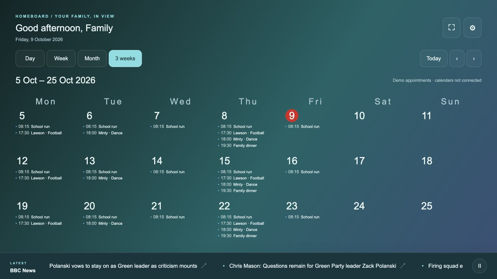
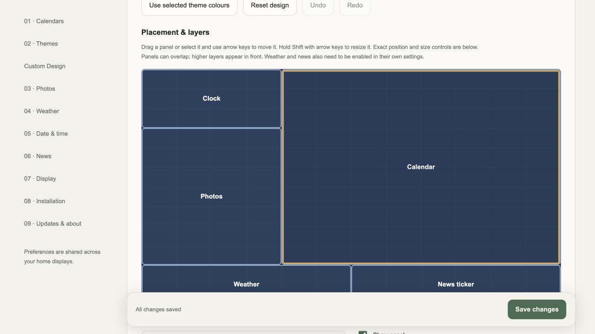
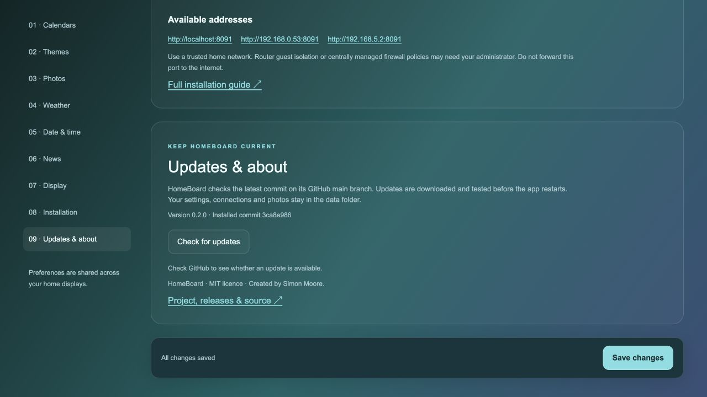

# HomeBoard

A self-hosted family dashboard with a separate settings page, read-only Calendar Links from Outlook, Google or Apple calendars, sixteen themes plus a visual Custom Design editor, a photo slideshow, OpenWeather forecasts and RSS news.
Open `/` for the display and `/settings` to configure it. Settings are shared
across displays and persist on the server. The dashboard has no upload controls.

## v0.21

- Continuous calendar browsing: scroll or select **Continue to later dates** in Upcoming, Day, Week, Month and 3 weeks. Each page fetches its own dates, including recurring appointments and month-grid overflow days. Today and previous/next navigation remain available.
- **Settings → Custom Design**: drag or use arrow keys to position five panels; Shift + arrows resizes them. Set exact grid dimensions, visibility and layers, with undo/redo and three starting layouts.
- Choose body/heading fonts, sizes, weight, spacing, colours, borders, shadows, corner radius, opacity and solid/gradient/photo backgrounds. Check contrast and preview the actual dashboard before saving. Portrait displays stack panels.
- Export/import named HomeBoard theme JSON files to share styles. Imports are validated and previewed before saving. Exports contain no calendar links, credentials, photos or personal preferences.

See [design format and guide](docs/CUSTOM-DESIGN.md) and [release notes](CHANGELOG.md).

## Screenshots

Screenshots use an isolated demo calendar, without personal calendar data or photos.
The Metro image uses an original landscape illustration and a labelled synthetic forecast.











## Installation

Clone this repository and open a terminal in its folder. Node 22.19+ (Node 24 recommended) is needed for
the setup CLI; Docker Desktop/Engine is needed for the Docker option. Folder
names containing spaces are supported. No npm compilation step is needed.

### Local Node (macOS / Linux)

```bash
npm run setup -- local
# Choose another port or an Apple Photos export folder:
npm run setup -- local --port 8090 --photos "/Users/you/Pictures/HomeBoard Photos"
```

The installer runs `npm ci`, creates a private `.env`, binds to `0.0.0.0`, checks
readiness and prints host LAN URLs. Keep the terminal open. On macOS, an enabled
application firewall can require `sudo` to allow the Node executable. On Linux,
active UFW/firewalld gets a rule limited to connected local IPv4 subnets. The
installer does not disable a firewall or configure router port forwarding.

For a Linux boot service, put the checkout at a service-readable location such
as `/opt/homeboard` and run:

```bash
sudo node scripts/setup.mjs local --service
journalctl -u homeboard-dashboard
```

This creates the unprivileged `homeboard` service account and enables a systemd
service. macOS foreground mode is supported; for automatic startup use Docker's
restart policy and enable Docker Desktop at login. `--dry-run` prints a setup
plan without changing files, firewall rules or starting services.

### Docker

```bash
npm run setup -- docker
# With a host folder mounted read-only for photos:
npm run setup -- docker --photos "/Users/you/Pictures/HomeBoard Photos"
```

In photo settings choose `/apple-photos` and the Folder or combined source.
The installer sets the host port and LAN URLs, builds and starts the container,
and checks readiness. Photo uploads, credentials, caches and preferences persist
in the `homeboard-data` named volume. Folder originals are mounted read-only.
The image runs as the `node` user and includes a healthcheck.

If Node is not installed on the Docker host, Docker Compose works directly:

```bash
cp .env.example .env
mkdir -p data/apple-photos
docker compose up --build -d
docker compose ps
```

Set `DASHBOARD_PORT`, `APPLE_PHOTOS_DIR` and optional `LAN_URLS` (comma-separated
host URLs) in `.env`. Compose publishes the port on LAN interfaces. Find the
host's IP using your OS network settings; container IPs are not host LAN IPs.
`docker compose down` preserves data; **`docker compose down -v` deletes it**.
Use volume backups and reserve the host's IP on your router.

### Proxmox LXC

Run the installer **on the Proxmox host**, from a checkout of this repository.
Download a Debian or Ubuntu container template first through Proxmox. With no
arguments the script asks for a new container ID and a downloaded template.

```bash
bash scripts/install-lxc.sh
# Or specify every option:
bash scripts/install-lxc.sh \
  --id 120 \
  --template local:vztmpl/debian-13-standard_VERSION_amd64.tar.zst \
  --storage local-lvm --bridge vmbr0 --port 8080
# Inspect the plan first:
bash scripts/install-lxc.sh --id 120 \
  --template local:vztmpl/debian-13-standard_VERSION_amd64.tar.zst --dry-run
```

Replace `VERSION` with an actual downloaded template name. The script refuses
an existing container ID, validates the bridge, creates an unprivileged LXC,
attaches `eth0` to the chosen existing bridge with DHCP and creates a firewall
file for this new guest. Dashboard traffic is allowed from RFC1918 private LANs;
DHCP is enabled. It copies app source without credentials/data, installs verified
official Node binaries, creates the systemd service and prints the assigned URLs.
It does not rewrite the Proxmox host bridge or host firewall policy. It needs
working DHCP, DNS and outbound HTTPS. Custom VLANs, non-RFC1918 networks, or an
upstream firewall can need administrator-specific rules. Reserve the guest's
DHCP address on your router.

For a NAS photo folder, mount the share inside the guest and enter that guest
path in photo settings. Apple Photos needs a Mac to download/export photos first;
LXC cannot run the Mac Photos app. Log access:

```bash
pct exec 120 -- journalctl -u homeboard-dashboard
```

The LXC script's syntax and plan are tested. Creating a real guest remains to be
verified on a Proxmox host; this Mac is not a Proxmox host.

## Settings

### Calendar Link

Paste an ICS / iCalendar subscription URL into **Settings → Calendar Link** and
choose **Save & check calendar link**. Microsoft and Google login are unnecessary
for a published subscription, so their setup controls have been removed.

- Outlook: Settings → Calendar → Shared calendars → Publish a calendar; copy ICS.
- Google Calendar: Settings for the calendar → Integrate calendar → Secret address
  in iCal format. [Google's subscription instructions](https://support.google.com/calendar/answer/37648).
- Apple Calendar/iCloud: share the calendar publicly and copy the subscription
  link. `webcal://` links are converted to HTTPS.
  [Apple's calendar sharing instructions](https://support.apple.com/en-gb/guide/icloud/mm6b1a9479/icloud).

The link stays in the server's private credentials file. Anyone with it may be
able to read the published details; revoke or replace it in your calendar service
when needed. Calendar changes are checked every five minutes. Recurring events,
all-day dates and privacy masking are supported. Cancelled statuses, cancellation
messages, recurring cancellations and whole-word cancelled/canceled title markers
are omitted, including publishers that keep a cancelled appointment CONFIRMED.

### Themes

Tide, Observatory, Glasshouse, Folio, Metro and Portrait add wall-display layouts
to the original HomeBoard, Midnight, Chalkboard, Coastal, Forest, Sunset, Minimal, Lavender, Aurora,
and Gallery are original CSS themes with previews. They include light/dark,
calendar-led, photo-backdrop and gallery layouts. **Metro** fills the viewport with
a 38% photo rail on the left, a light Roboto clock with seconds, a seven-day
weather overlay and a black upcoming agenda on the right. Its 14-day agenda
groups appointments by day, shows start/end times and locations, masks private
details and omits finished appointments today. The RSS ticker sits below the
agenda. Portrait screens stack the photo rail above the calendar. Select Metro
and save to apply its suggested Upcoming view; other calendar views still work.
Roboto is served locally under its [SIL Open Font License](public/fonts/OFL.txt). Google Images and DAKboard's
community gallery informed the styles; there is no publicly verifiable popularity
ranking, so these are **ten curated starting themes**, not a claimed statistical
"top ten". No third-party screen images or proprietary theme code are copied.
See [research and inspiration](docs/RESEARCH.md).

### Photos / Apple Photos

Upload photos from settings only. The browser resizes JPEG/PNG/WebP and supported
other images to at most 2560px and converts to JPEG. Uploads persist on the server.
Choose sequential/shuffle, crossfade/fade/slide/zoom/cut, interval (5–3600 seconds),
transition duration, and cover/contain framing. Reduced-motion browsers use cuts.
Folder photos are refreshed every minute; next/previous appears on hover/focus.

Apple connection is a **read-only local folder connection**, not Apple-account
OAuth or iCloud password collection. On a Mac, export an Apple Photos album as
JPEG to a folder and enter its absolute server path. A downloaded `.photoslibrary`
can supply its `originals` JPEG/PNG/WebP/GIF files, but edits, album membership,
cloud-only files and HEIC conversion need export through Photos. Folder originals
are never deleted by the app. The server skips symbolic links and scans up to
20,000 entries, 12 levels deep. macOS permissions may need to allow the hosting
process to read the folder. Docker/LXC need a mount visible inside their container.
[Apple's export instructions](https://support.apple.com/en-kg/guide/photos/pht6e157c5f/mac).

### Weather

Enter an OpenWeather API key, start typing a town or postcode, then select a
suggestion. Selection saves the location and checks the forecast automatically.
Choose Celsius/m/s or Fahrenheit/mph and turn on weather to show it on the display.
Full UK postcodes and outward codes use OpenWeather's postcode geocoder; towns
use its location search. Five suggestions at most are shown, with country/state
information to distinguish places.

**Automatic** uses seven-day One Call access when available and falls back to the
standard five-day forecast when that subscription is unavailable. Your standard
key can therefore work without adding a paid One Call plan. **Standard five-day**
always uses the basic API. One Call 4.0/3.0 remain explicit choices for compatible
subscriptions. New keys can take time to activate; errors identify key rejection,
subscription access and request limits.

Standard daily lows/highs and precipitation chances aggregate the available
three-hour forecast intervals; today can be partial. The widget shows the actual
five or seven days available. Forecasts are cached for ten minutes, keyed by
location, units, API, timezone and a private key fingerprint; replacing a key
cannot reuse the previous key's successful cache. Failed updates label any cached
forecast. Keys are never returned to the browser.
[Standard forecast API](https://openweathermap.org/api/forecast5),
[One Call 4.0](https://openweathermap.org/api/one-call-4),
[geocoding](https://openweathermap.org/api/geocoding-api).

### Date/time, news and display

Select an IANA timezone, long/DMY/MDY/ISO date, digital/analog/both clock and 12/24
hour time. Calendar day boundaries use that timezone, including DST; all-day
appointments retain their calendar dates.

Toggle RSS/Atom headlines, choose a news source or Custom RSS / Atom, and set a
headline count. Presets include BBC, CNBC, CNN via Google News, Fox News, Sky News,
GB News, The Guardian, NPR and Al Jazeera. CNN’s legacy RSS feed was stale, so its
preset clearly identifies the Google News aggregator. See the
[checked news sources](docs/NEWS-SOURCES.md).
Feeds are fetched on the server, cached, and rendered as safe text with HTTP(S)
links in a scrolling bottom ticker. Pause it with its button; keyboard focus and
hover also pause movement. Reduced-motion preferences switch to static scrolling. Local/private-network destinations, unsafe redirects, XML entity/DOCTYPE
payloads and oversized feeds are rejected.

Extra features inspired by other dashboards: selected-calendar filtering,
starting view, fullscreen button, scheduled night dimming, stale-data indicators,
and display-preference import/export. Exports exclude credentials, tokens,
server paths and calendar connection details.

## Network and data

This app is for a trusted private home network. Anyone who can reach it can view
the calendar/photos and change settings; there is no per-user dashboard login.
Do not expose its port directly to the internet. HTTP LAN traffic is unencrypted;
use an authenticated HTTPS proxy for broader access. Secrets/tokens are stored
as restricted-permission plaintext files in the data directory, not an encrypted
vault. Protect and back up that directory or Docker volume. Browser privacy
masking is not an access-control mechanism.

The installer can configure the application's listener and supported host/guest
firewalls. It cannot resolve Wi-Fi guest isolation, VLAN routing or router policy
without details about that network. Settings lists available addresses. Test from
a second device and reserve addresses in DHCP to keep display URLs stable.
Environment values in `.env` take precedence on restart; when managing credentials
in settings, leave the corresponding environment variables empty. `npm start`
does not load `.env`; use the installer or `node --env-file=.env scripts/runner.mjs`.

## Development and validation

```bash
npm ci
npm run verify
npm run build
```

Tests use temporary data and isolated ports, with fakes only at external provider
boundaries. The original ZIP regression assertions remain intact. The
[HomeBoard testing rules](docs/testing/homeboard/README.md) define the protocol,
review requirements and verification checks. See [DEVELOPMENT.md](DEVELOPMENT.md)
for the Node.js workflow.
[Release validation record](docs/testing/VALIDATION-release-v0.2.md) and
[Metro layout validation](docs/testing/VALIDATION-metro.md), and
[settings/weather validation](docs/testing/VALIDATION-simple-settings.md) record actual checks and limits.
GitHub Actions installs dependencies, checks syntax, runs the entire suite,
checks installer shell syntax, builds Docker and repeats tests in the image.

Live provider consent, actual Apple library permissions, physical Safari/iPad or
Chrome/Android, and a real Proxmox installation need verification with the relevant
accounts/devices/host. Automated provider fixtures establish request/response
wiring and failure behaviour; they do not establish successful live authentication.


## Shared albums and news transport

For Apple Photos, enable **Public Website** on a Shared Album and paste its
`https://www.icloud.com/sharedalbum/#…` URL into Settings → Photos. Select
Apple iCloud shared album, or All connected photo sources. HomeBoard checks the
album every five minutes, proxies images through local read-only routes and
excludes the album URL from preference exports. No Apple password is needed.
The public-album protocol is undocumented by Apple and can change. Folder and
upload sources remain available without a public album.

The BBC RSS feed works in the production Node 24 container. Public feed fetches
use the installed Undici fetch and dispatcher together, revalidate DNS at socket
connection, validate redirect destinations and cap downloaded bytes. Mixing the
Node-bundled fetch with a different dispatcher version caused the previous error.

Six new themes add gradient wall calendars, photo/weather rails, glass panels,
an editorial planner and a portrait photo layout. Selecting a new style also
selects its suggested calendar view; you can override that view before saving.
The rolling three-week view crosses month boundaries and advances by a week.


## Automatic updates

Open **Settings → Updates & about → Check for updates**. HomeBoard compares its
running Git commit with `MooreSi/HomeBoard`'s `main` branch. If a newer commit is
available, **Update & restart** downloads it into a separate version directory,
installs dependencies and runs verification before switching. It restarts the
application and update controller automatically. A failed verification keeps the
current process running; a failed boot restores the previous code and JSON
preferences/credentials from a private backup. Uploaded photos stay in place.

Use `npm start` or the installer to start the managed launcher. Direct
`node server.mjs` starts show a clear setup message instead of offering a restart
that cannot work. Source changes in a native checkout block installation rather
than overwriting your work. One managed instance should own each data directory.

Git is included in the Docker image and LXC bootstrap. The local installer checks
Git and installs it on Debian/Ubuntu, or via Homebrew when available on macOS.
Without Homebrew, install Apple's Xcode Command Line Tools first. GitHub access
uses the public repository and requires no GitHub token. Docker updates run inside
the container; the Docker socket is not mounted. Installed versions, update
state and backups live under `data/updates`, so they survive container recreation.
A newer image/base checkout takes precedence when you explicitly reinstall.

Updates cover application source and npm dependencies. A release requiring a
newer Node runtime stops with an actionable message; run the installer/rebuild
Docker to upgrade the runtime and OS packages. Offline GitHub access also leaves
the current app running and reports the failure. Updates follow `main`, not just
release tags, and run only when you click the install button.

## Release and licence

The public release is **[HomeBoard v0.2](https://github.com/MooreSi/HomeBoard/releases/tag/v0.2)**.
Earlier validation files retain their development-build labels. HomeBoard is
licensed under the [MIT licence](LICENSE), copyright © 2026 Simon Moore.
Third-party npm dependencies retain their own licences in their installed
packages, including node-ical (Apache-2.0), Undici and fast-xml-parser (MIT).
